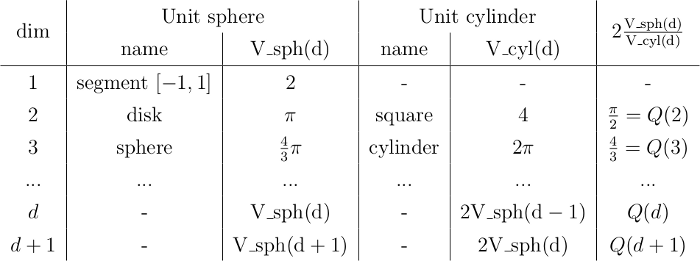

#Peer-graded Assignment: Sampling and integration in high dimensions

Introduction to Homework session 4 of Statistical Mechanics: Algorithms and Computations

In this homework Session 4, you will grasp the intimate relation between sampling and integration and sense the full power of the Markov-chain Monte Carlo method, especially in high dimensions. Our goal will be to compute the volume of the sphere in 200 dimensions. This volume is smaller than

0.0000000000000000000000000000000000000000000000000000000000000000000000000000000000000000000000000001...

Computing this volume is a sampling problem, and it literally corresponds to finding a needle in a haystack (or rather, a specific atom in all the observable universe). Nevertheless, we will succeed.

**Two remarks before we start:**

1) Often, one speaks of the "hypersphere in 200 dimensions", and we will also need the "hypercylinder". In this homework, we simply leave out the "hyper", and speak of "spheres" in d dimensions and "cylinders" in d dimensions. You will discover, among others, that the disk is a two-dimensional sphere, and that the square is a two-dimensional cylinder (see below). Of course there are precise mathematical definitions. In particular, we consider unit spheres and unit cylinders.

2) In one dimension, normally, one speaks of a "length", in two dimensions, we have an "area", and in three dimensions, there are "volumes". In this homework, we speak of "volume" for all these measures. A "volume", in our definition, has no units (like cm^3) and, although it might sound strange to some of you, we may compare volumes across different dimensions.

**Some mathematical definitions, and some discussion:**

**Unit sphere in d dimensions**

Definition: d-dimensional object of all points (x_0, ..., x_{d-1}) such that (x_0^2 + .... + x_{d-1}^2) < 1.

Special cases, and general case for unit spheres

* In d=1, the unit sphere is the segment [-1,1] and its volume (or rather the length of the segment) is equal to 2.
* In d=2, the unit sphere is equal to the disk of radius 1, and its volume (or rather its area) is equal to pi
* In d=3, the unit sphere has volume 4/3 pi, as you can look up in your old Math books from .
* In general d, we call the volume of the unit sphere V_sph(d).

**Unit cylinder in d dimensions**

Definition: d-dimensional object of all points (x_0, ..., x_{d-1}) such that (x_0^2 + .... + x_{d-2}^2) < 1 and -1 < x_{d-1} < 1.

The unit cylinder in d dimensions is put together from a unit sphere in d-1 dimensions, and a segment of length 2 along one dimension.

Special cases, and general case for unit cylinders

* In d=1, the unit cylinder does not exist.
* In d=2, the unit cylinder is equal to the square with x and y between -1 and 1. Its volume is equal to 4.
* In d=3, the unit cylinder is put together from a disk (area pi) and a segment of length 2, its volume is equal to 2 pi. Again you can look this up in your old math books, or on wikipedia.
* In general d, we call the volume of the unit cylinder V_cyl(d).

**A crucial table containing exact volumes and relations between volumes in different dimensions:**

